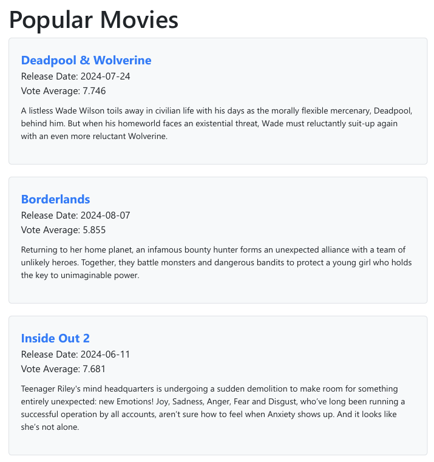

# MovieDB to PDF Generator


This application fetches movie data from The Movie Database API and generates PDF documents containing information about each movie, including pictures. Each PDF includes the movie's title, release date, vote average, and poster image.

## Table of Contents

- [Features](#features)
- [Dependencies](#dependencies)
- [Prerequisites](#prerequisites)
- [Installation](#installation)
- [Usage](#usage)
  - [Generate PDF for a list of movies](#generate-pdf-for-a-list-of-movies)
  - [Generate PDF for a Single Movie](#generate-pdf-for-a-single-movie)
- [Contributing](#contributing)
- [License](#license)

## Features

- Fetches movie data from TMDb API.
- Generates PDF document with list of latest new movies.
- Includes movie title, release date, vote average, and poster image in the PDF.
- Supports batch processing of multiple movies.
- PDF documents contains pictures and links for download PDF file for each movie in list. (Links for download new PDF file by movie ID)

## Dependencies

  1. express: For building the web server.
  2. axios: For making HTTP requests to the TMDb API.
  3. pug: For rendering HTML templates.
  4. puppeteer: For generating PDFs from HTML content.
  5. dotenv: For loading environment variables from a .env file.

## Prerequisites

- Node.js (>= 20.x)
- npm (>= 6.x)
- TMDb API Key (Get it from [here](https://www.themoviedb.org/documentation/api))

## Installation

Clone the repository:

```bash
git clone <repo>
cd movie-pdf-generator
```

Install dependencies:

```bash
npm install
```

Create a `.env` file in the root directory and add your TMDb API key:

```bash
PORT=8006
SELF_URL=http://localhost:8006
THE_MOVIE_DB_READ_API_KEY=""
```

Start the application:

```bash
npm run start:dev
```

## Usage

### Generate PDF for a list of movies

Open your browser and navigate to `http://localhost:8006/movies`.

It will download PDF file with list of latest new movies.

Click to any movie title in list to download PDF file with full information about this movie with poster image.



### Generate PDF for a Single Movie

Open your browser and navigate to `http://localhost:8006/movies/550`. (550 - movie ID)

It will download PDF file with full information about movie with poster image, release date, etc...

Perfect working as random movie, just imagine random number and put it to URL.


## Contributing

Contributions are welcome! Please open an issue or submit a pull request.

## License

This project is licensed under the MIT License.
